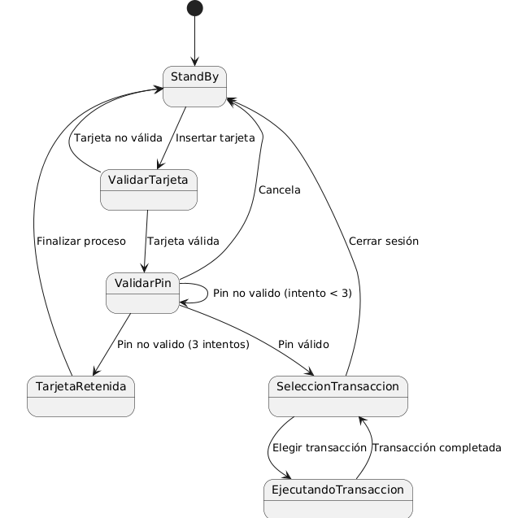

# Diagrama de estados

## Diseñar el diagrama de estados del sistema

- Diagrama de estados

- código para generarlo

    @startuml
  
    [*] --> StandBy
    
    StandBy--> ValidarTarjeta : Insertar tarjeta
  
    ValidarTarjeta --> ExpulsarTarjeta : Tarjeta no válida
  
    ExpulsarTarjeta --> StandBy : Tarjeta expulsada
  
    ValidarTarjeta --> ValidarPin : Tarjeta válida
    
    ValidarPin --> ValidarPin : Pin no valido (intento < 3)
  
    ValidarPin --> TarjetaRetenida : Pin no valido (3 intentos)
  
    ValidarPin --> SeleccionTransaccion : Pin válido
  
    ValidarPin --> StandBy : Cancela
    
    TarjetaRetenida --> StandBy: Finalizar proceso
    
    SeleccionTransaccion --> EjecutandoTransaccion : Elegir transacción
  
    SeleccionTransaccion --> ExpulsarTarjeta : Cerrar sesión
    
    EjecutandoTransaccion --> SeleccionTransaccion : Transacción completada
  
    @enduml

## Describir el diagrama realizado, interpretando cada uno de los elementos que aparecen en el

  1. El sistema se matiene todo el rato en Stand By (en espera) hazta que una persona introduza una tarje de credito
  2. El sistema valida la tarjeta para que sea del banco actual y sea real y cuando lo hace puede pasar una de las 2 siguientes cosas
  3. La tarjeta no es valida por lo cual devuelve la tarjeta

