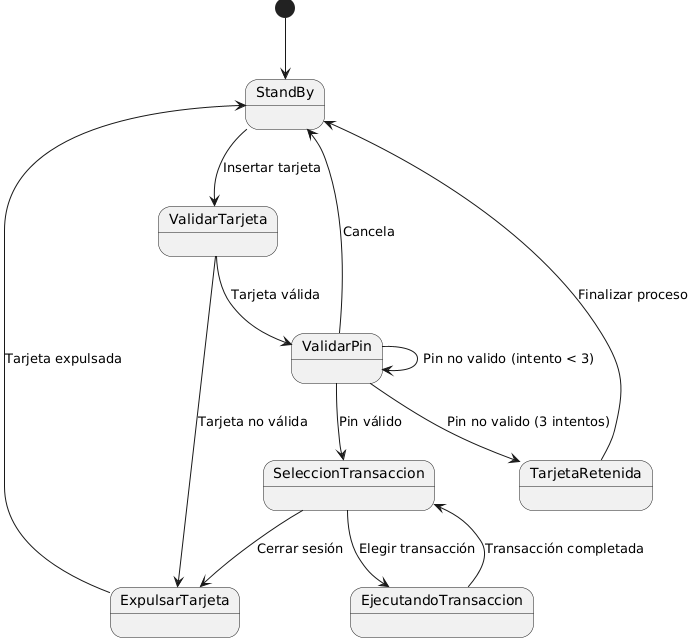

# Diagrama de estados

## Diseñar el diagrama de estados del sistema

- Diagrama de estados

- código para generarlo

    @startuml
  
    [*] --> StandBy
    
    StandBy--> ValidarTarjeta : Insertar tarjeta
  
    ValidarTarjeta --> ExpulsarTarjeta : Tarjeta no válida
  
    ExpulsarTarjeta --> StandBy : Tarjeta expulsada
  
    ValidarTarjeta --> ValidarPin : Tarjeta válida
    
    ValidarPin --> ValidarPin : Pin no valido (intento < 3)
  
    ValidarPin --> TarjetaRetenida : Pin no valido (3 intentos)
  
    ValidarPin --> SeleccionTransaccion : Pin válido
  
    ValidarPin --> StandBy : Cancela
    
    TarjetaRetenida --> StandBy: Finalizar proceso
    
    SeleccionTransaccion --> EjecutandoTransaccion : Elegir transacción
  
    SeleccionTransaccion --> ExpulsarTarjeta : Cerrar sesión
    
    EjecutandoTransaccion --> SeleccionTransaccion : Transacción completada
  
    @enduml

## Describir el diagrama realizado, interpretando cada uno de los elementos que aparecen en el

  - El sistema se matiene todo el rato en Stand By (en espera) hazta que una persona introduza una tarje de credito
  - El sistema valida la tarjeta para que sea del banco actual y sea real y cuando lo hace puede pasar una de las 2 siguientes cosas
      - La tarjeta no es valida por lo cual devuelve la tarjeta y una vez expulsada del cajero se queda en modo Stand By
      - La tarjeta es valida y pasa al siguiente estado
  - El usuario debe validar su tarjeta introduciendo un pin que tiene que ser valido y tiene como mucho 3 intentos, aqui pueden pasar otras 2 cosas
      - El pin no es valido 3 veces por lo cual el cajero retiene la tarjeta y no se la devulve al usuario ya que sino se sabe el pin puede haber sido robada y vuelve al modo Stand By
      - El pin es valido y pasa al siguiente estado
  - El sisteme mostraria el tipico menu de seleccionar un transaccion donde puede suceder otras 2 cosas
      - El usuario elige una transaccion por lo cual se ejecuta esa transaccion y vuelve al menu a la espera de que el usuario decida que hacer
      - El usuario elige cerrar sesion por lo cual el cajero expulsa la tarjeta y vuelve al modo Stand By

